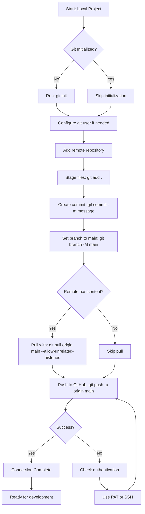

# Git Connection Workflow

## Process Flow Diagram



## Quick Command Reference

### Initial Setup
```bash
# 1. Initialize repository
git init

# 2. Add remote
git remote add origin https://github.com/swapnilchowdhury-2003/Codeville-Kid-s-Coding-Kingdom.git

# 3. Stage and commit
git add .
git commit -m "Initial commit"

# 4. Set main branch
git branch -M main

# 5. Push to GitHub
git push -u origin main
```

### Daily Workflow
```bash
# Check status
git status

# Stage changes
git add .

# Commit changes
git commit -m "Description of changes"

# Push to GitHub
git push

# Pull from GitHub
git pull
```

## Repository Structure

```
Kids coding project/
├── .git/                 (created after git init)
├── index.html           (existing file)
├── git-setup-plan.md    (this planning document)
└── git-workflow-diagram.md
```

## Authentication Options

### Option 1: HTTPS with Personal Access Token
- Generate PAT from GitHub Settings > Developer settings > Personal access tokens
- Use PAT as password when prompted

### Option 2: SSH Keys
- Generate SSH key: `ssh-keygen -t ed25519 -C "your_email@example.com"`
- Add to GitHub: Settings > SSH and GPG keys
- Use SSH URL: `git@github.com:swapnilchowdhury-2003/Codeville-Kid-s-Coding-Kingdom.git`

### Option 3: GitHub CLI
- Install GitHub CLI
- Run: `gh auth login`
- Follow prompts